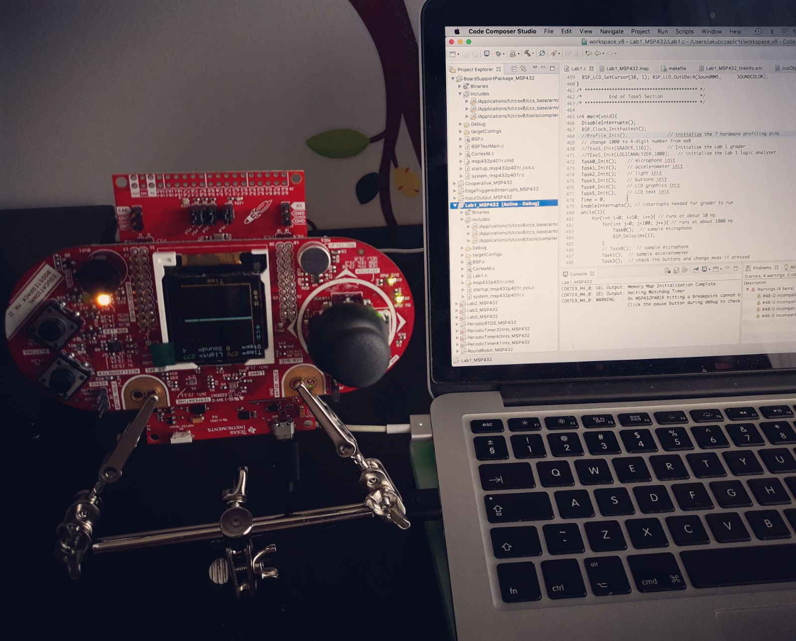

# rtbn-msp432
UTAustinX+UT.RTBN.12.01x+3T2016

Lab code for course UTAustinX: UT.RTBN.12.01x Realtime Bluetooth Networks

Courseware : https://courses.edx.org/courses/course-v1:UTAustinX+UT.6.03x+1T2016/info

Introduction : http://edx-org-utaustinx.s3.amazonaws.com/UT601x/RTOS.html

Piazza: https://piazza.com/class/iqs6f93gxp6jt?cid=588#

Code converted from Keil (on Windows) to Code Composer Studio Version: 8.0.0 (on Mac).
